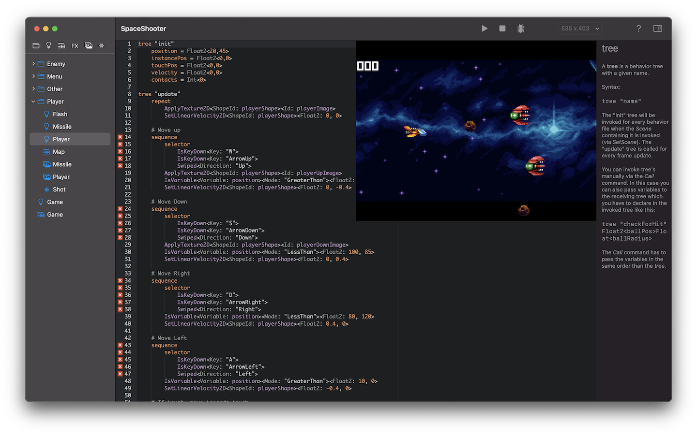
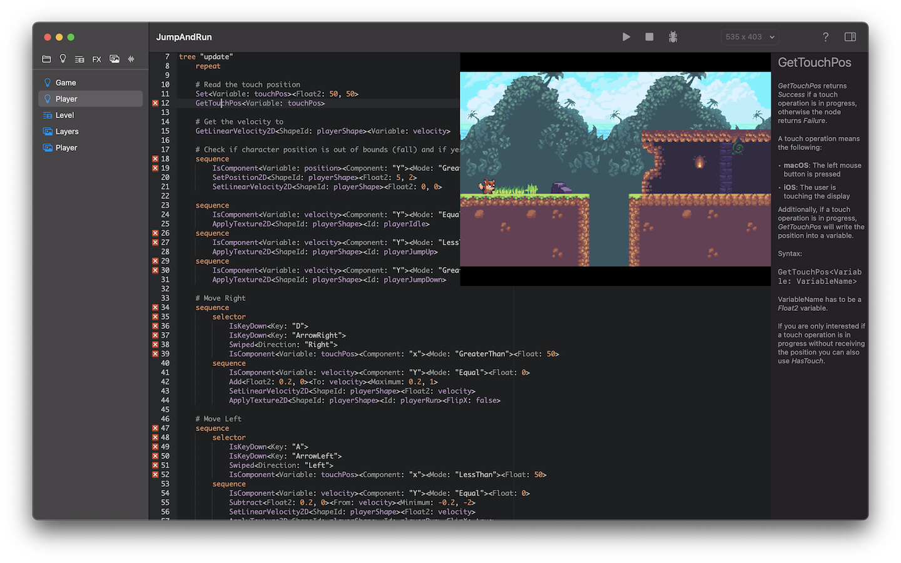

# Denrim

<table><tr>
<td>  </td>
<td>  </td>
</tr></table>

---

v1.0x is the current version in the AppStore, the main branch is work under development for v2 with many enhancements like Lua script support.

---

Denrim is a 2D game creator utilizing a unique text based approach for game logic and resources. It is highly optimized for the Metal GPU framework and combines ease-of-use with the highest possible performance.

Denrim utilizes a text based approach to game creation paired with instant previews and visual game state feedback. You do not need to be a developer to create games with Denrim as no scripting languages are used.

Text based behavior trees are easy-to-use yet powerful tools to create game logic and AI. They are easier to use and  understand than scripting languages but are natively compiled into Swift and therefore offer the maximum in native performance. During game execution visual feedback of the state of the nodes are provided for easy debugging.

An integrated 2D physics engine provides realistic and fast physics for your game.

Map files map resources like shapes, images and audio files to layers and scenes, and resource parameters can be directly bound to behavior tree variables.

Metal shaders are natively supported and can be edited with live preview. Shaders can also be bound directly to behavior tree variables, offering powerful special effects based on the game state.

Games created with Denrim can be played on macOS, iOS and tvOS using a special free player app. Note that you need to have an Apple Developer account to release games on the AppStores.

Denrim ships with 3 example games for learning, a space shooter, a jump and run concept and a bricks game. Using the context sensitive help it is easy to understand these examples and learn.

## Behavior Trees

* Easy-to-use text based approach to game logic and artificial intelligence.
* Maximum performance with native Swift compilation.
* Visual feedback during game execution on the state of nodes inside the trees.
* Behavior variables can be bound to shape parameters and shaders.
Context sensitive help is available for all behavior tree nodes.
Live debugging of behavior variables.

## Map Files

* Text based meta language to defines (texturized) shapes and other resources for layers and scenes.
* Offers instant syntax check and validation.
Supported resources are shapes, images, audio and metal shaders.
Define physical behavior of your shapes.
* Context sensitive help is available anytime and for all functionality.

## Metal Shaders

* Offer a powerful way to create special effects inside games but are optional, you do not need to be able to code shaders to create games with Denrim.
* Can be edited inside the editor with realtime preview.
* Can be bound to behavior tree variables to allow game state dependent special effects.
* Instant visual feedback on compile issues.

It is currently possible to create arcade and jump and run games with Denrim. More game types and features are under development.
